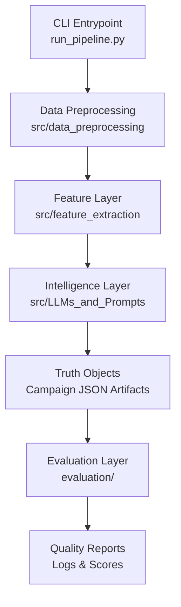
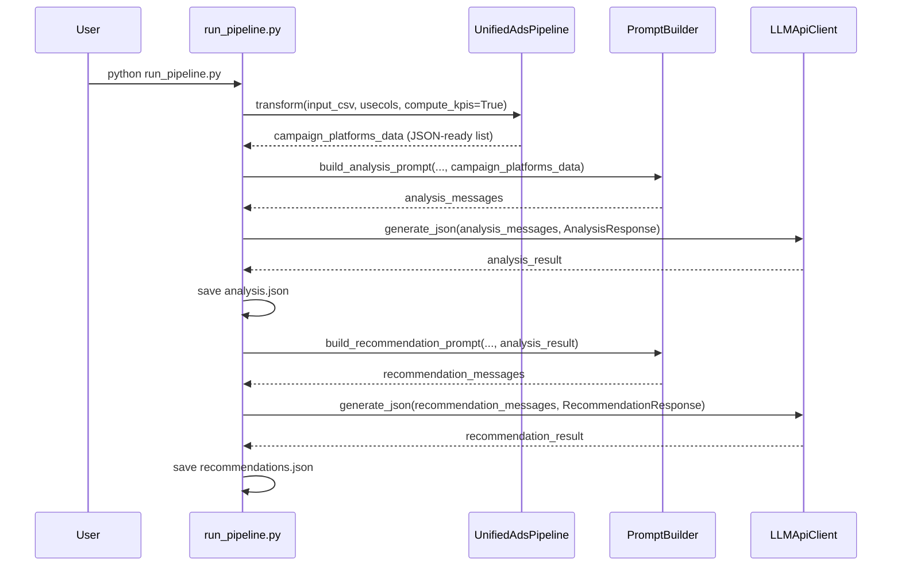

# Unified Marketing Truth Engine

A modular Python pipeline that converts raw paid media performance data into structured, business-friendly LLM outputs in two stages:
1. Ingestion & Preprocessing (Standardizing raw data)
2. Intelligence Layer (Analysis & Recommendations)
3. Evaluation Layer (Quality Control via DSPy)

The project is organized as a modular architecture under `src/` with a CLI entrypoint in `run_pipeline.py`, complemented by an automated `evaluation/` engine.

## What This Application Does

- Ingests ads data from file or DataFrame input.
- Normalizes and validates a unified schema.
- Enforces types, de-duplicates, aggregates by platform, and computes KPI features.
- Converts processed rows into a strict JSON payload for prompting.
- Runs a 2-stage LLM workflow:
  - Stage 1: structured performance analysis
  - Stage 2: structured recommendation cards
- Saves machine-readable JSON artifacts for downstream use.

## Architecture Layers



### Layer Responsibilities

- `src/data_preprocessing`
  - `AdsDataLoader`: reads `.csv`, `.xlsx`, `.xls`, `.json`, `.parquet`.
  - `UnifiedAdsSchema`: required-column and numeric validations, alias model.
  - `AdsPreprocessor`: type casting, dedupe, aggregation, JSON conversion.
  - `UnifiedAdsPipeline`: orchestrates transform steps.

- `src/feature_extraction`
  - `AdsKpiFeatures`: computes `ctr`, `cpc`, `cpm`, `cvr`, `cpa`, `roas` where possible.
  - `AdsFeatureExtractor`: optional diagnostics and grouped extraction utilities.

- `src/LLMs_and_Prompts`
  - `PromptLoader`: loads prompt templates from module folder.
  - `PromptBuilder`: injects runtime data into template placeholders.
  - `structured_outputs.py`: Pydantic output contracts for stage 1 and stage 2.
  - `LLMApiClient`: OpenAI wrapper for text and schema-parse JSON.

- `evaluation/`
  - `llm_analysis_evaluator.py`: DSPy-based quality evaluator for the analysis stage.
  - `recommendation_response_eval.py`: DSPy-based quality evaluator for recommendation cards.
  - `validation_utils.py`: Shared scoring and data parsing utilities.

## End-to-End Flow



## Input Data Contract

Minimum columns expected by the current pipeline run path:

- `date`
- `platform`
- `campaign_type`
- `impressions`
- `clicks`
- `spend`
- `conversions`
- `revenue` (loaded by default in `run_pipeline.py`, but see constraints section)

Also supported at schema/KPI level when present:

- `conversion_value`
- `reach`
- `frequency`
- optional IDs for deduping (`account_id`, `campaign_id`, `adset_id`, `ad_id`)

## LLM Contracts

### Stage 1 Output

`AnalysisResponse`:
- `analysis.executive_summary`
- `analysis.budget_and_efficiency[]`
- `analysis.results_and_value[]`
- `analysis.cross_channel_patterns_and_risks[]`
- `analysis.channel_notes[]`
- `analysis.missing_info[]`

### Stage 2 Output

`RecommendationResponse`:
- `recommendations[]` where each card includes:
  - `title`
  - `whats_happening`
  - `what_you_should_do[]`
  - `why_this_matters`
  - `priority`
  - `expected_impact`
  - `owner_suggestion`

## Project Structure

```text
  evaluation/
    llm_analysis_evaluator.py
    recommendation_response_eval.py
  src/
    data_preprocessing/
    feature_extraction/
    LLMs_and_Prompts/
    modeling/
    utils/
  run_pipeline.py
  requirements.txt
  .env.example
```

## Setup

1. Create and activate a Python virtual environment.
2. Install dependencies:

```bash
pip install -r requirements.txt
```

3. Configure environment variables:

```bash
copy .env.example .env
```

Set at least:

```env
OPENAI_API_KEY="<your_api_key>"
OPENAI_MODEL="gpt-5-mini"
```

Note: `.env.example` also includes `GROQ_API_KEY`, but the current pipeline uses OpenAI only.

## Run the Pipeline

```bash
```bash
python run_pipeline.py \
  --input-csv data/raw/ads_data.csv \
  --analysis-output data/outputs/campaign_result.json
```

**Output Artifact:**
The pipeline generates a unified "Truth Object" in `data/outputs/campaign_result.json`. This file contains the raw input data, the structured analysis, and the generated recommendation cards in one machine-readable schema.

## Run Evaluation & Testing Flow

The system includes a DSPy-powered evaluation layer to grade the quality of the analysis and recommendations. These scripts read directly from the pipeline's output JSON files.

### 1. Analysis Evaluation
Grades the logic, clarity, and relevance of the performance analysis.

```bash
python evaluation/llm_analysis_evaluator.py --files data/outputs/campaign_result.json
```

### 2. Recommendation Evaluation
Grades the clarity, accuracy, and feasibility of the recommendation cards.

```bash
python evaluation/recommendation_response_eval.py --files data/outputs/campaign_result.json
```

### 3. Testing the New Flow (Walkthrough)

1.  **Generate Data**: Run the pipeline to produce a new `campaign_result.json`.
2.  **Run Quality Audit**: Execute both evaluators using the `--files` argument pointing to your newly generated artifact.
3.  **Inspect Results**:
    *   **Console Output**: Review the ranked summary and structured verdicts (Accept/Revise/Reject) printed to the terminal.
    *   **Logs**: Comprehensive session logs and individual result files are saved in `logs/%Y-%m-%d/` for deep-dive auditing.
    *   **Audit Trail**: Check the reasoning fields in the saved evaluation JSONs to understand the LLM's critique.

## Constraints and Known Gaps (Current Code)

- `UnifiedAdsSchema.canonicalize_columns()` currently builds `rename_map` but does not apply a rename operation; alias canonicalization is not fully active in runtime.
- `run_pipeline.py` loads `revenue`, while KPI ROAS logic expects `conversion_value`; this can leave `revenue` and `roas` null in JSON output unless preprocessing is adjusted.
- `UnifiedAdsPipeline.transform()` currently hardcodes aggregation args (`platform`, no date grouping), even if optional parameters are passed.
- `AdsPreprocessor.aggregate_single_campaign()` contains a `group_keys` initialization ordering bug when `group_by_date=True`; default run path uses `False`, so this is not triggered in standard CLI execution.
- Prompt files `Prompt 1.txt` and `Prompt 2.txt` are legacy alternatives and are not used by the default CLI path.
- There is no automated unit test suite for pipeline transforms yet; existing `tests/` content focuses on LLM recommendation evaluation.

## Suggested Next Engineering Steps

1. Fix schema alias canonicalization (`rename(columns=rename_map)` and duplicate handling after rename).
2. Standardize value column naming (`revenue` vs `conversion_value`) across pipeline and KPI computation.
3. Make `transform()` honor passed aggregation parameters rather than hardcoded defaults.
4. Add unit tests for schema validation, KPI calculations, and aggregation edge cases.
5. Add a lightweight CI check to validate sample input -> output schema compliance.
