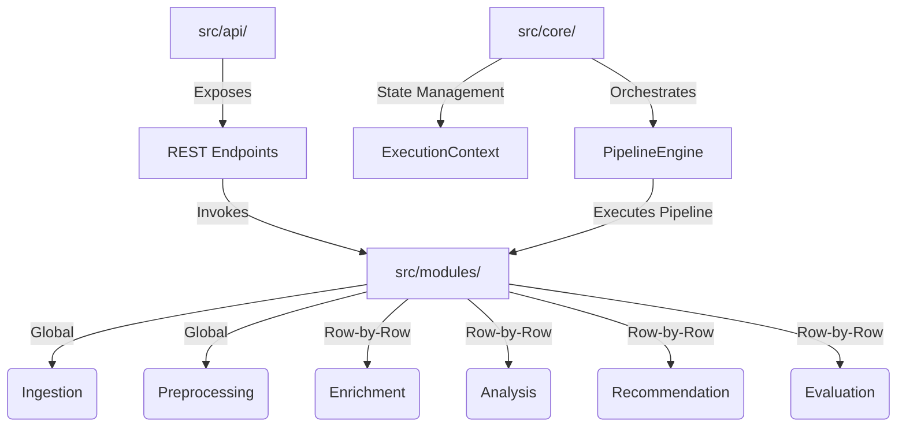
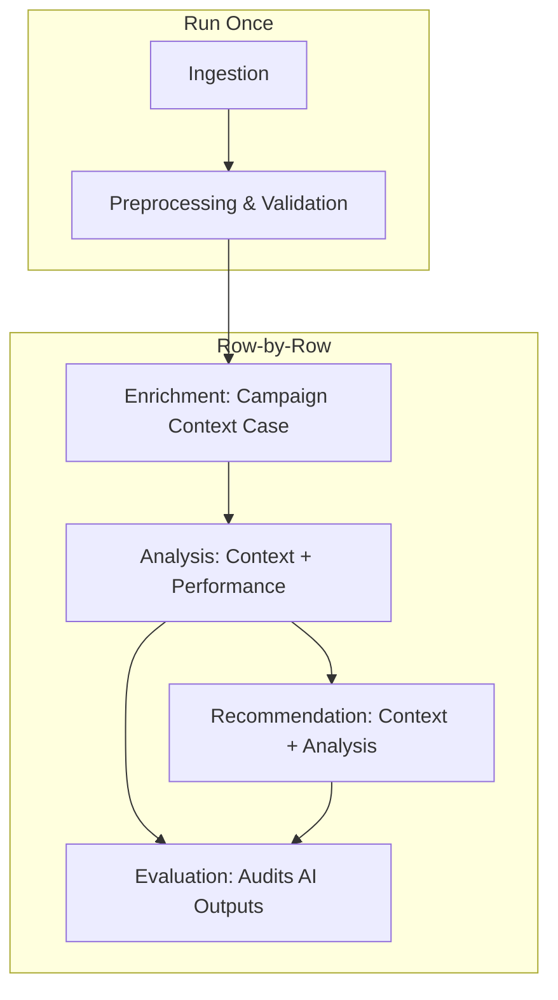
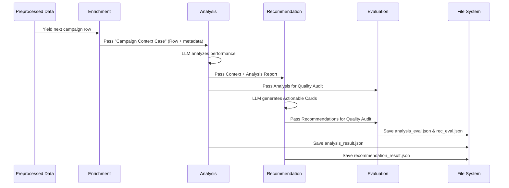
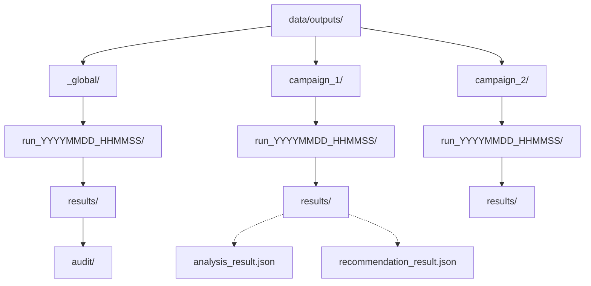

# Unified Marketing Truth Engine (Granular Edition)

A strictly granular, row-by-row Python pipeline that converts raw paid media performance data into structured, business-friendly LLM outputs using an iterative intelligence workflow.

## 🏛️ Granular Architecture
The engine is designed for **high-precision analysis**. Unlike traditional tools that aggregate data, this engine treats every single campaign (row) as an independent case study.



- **`src/core/`**: The engine's foundation, providing the `PipelineEngine`, `ExecutionContext` (supporting granular persistence), and the `BaseModule` interface.
- **`src/api/`**: FastAPI implementation providing synchronous access to Analysis and Recommendation workflows.
- **`src/modules/`**: Discrete processing stages (Ingestion, Preprocessing, Enrichment, Analysis, Recommendation, Evaluation) implemented as independent plugins.
- **`src/shared/`**: Centralized Pydantic models, prompt templates, and common utility functions.

## 🧠 Intelligence Workflow
The pipeline operates in two distinct phases:



### Phase A: Preparation (Run Once)
1. **Ingestion**: Loads the source dataset.
2. **Preprocessing**: Validates schema, cleans data, and standardizes columns globally for efficiency.

### Phase B: Iterative Analysis (Row-by-Row)
For **each row** in the dataset, the engine executes:



1. **Enrichment**: Generates a high-density "Campaign Context Case" including identity metadata (audience, industry) and performance metrics.
2. **Analysis**: Performs deep-dive LLM performance assessment on the individual campaign utilizing full unified context (Domain, Targets, Data).
3. **Recommendation**: Generates actionable cards utilizing the complete context and the preceding Analysis report.
4. **Evaluation**: Audits the quality of the AI outputs using a standardized prompt-based framework with full 360-degree context awareness (splitting Analysis and Recommendation grades into separate files).

## 📂 Output Structure



Every execution creates a nested structure within `data/outputs/`:
- **`_global/run_TIMESTAMP/results/audit/`**: Contains the globally preprocessed data and raw ingestion records.
- **`campaign_N/run_TIMESTAMP/results/`**: Isolated results for each campaign, including:
    - `analysis_result.json`
    - `recommendation_result.json`
    - `analysis_evaluation_results.json`
    - `recommendation_evaluation_results.json`

## 🎯 Goal-Oriented Logic
The pipeline is fully goal-oriented, meaning every step adjusts its behavior based on the `primary_goal` column in your CSV.

### 1. Specialized Metrics
The `MetricsCalculator` only calculates KPIs relevant to the specific goal (e.g., ROAS for "Increase Sales", CTR for "Traffic"). This ensures the AI receives high-density, relevant data without unnecessary bloat.

### 2. Strategic Prompt Injection
The `PromptBuilder` dynamically injects goal-specific instructions into the AI's system prompt using the `{{GOAL_INSTRUCTIONS}}` placeholder. These instructions are loaded from `src/shared/prompts/objectives/`.

### 3. Adding New Goals
To add a new goal:
1. Update `GOAL_MAP` in `src/shared/models/metrics.py`.
2. Create a new `.txt` prompt in `src/shared/prompts/objectives/`.
3. Register the mapping in `src/shared/utils/prompt_registry.py`.

## 🛠️ Developer Features
- **Goal-Specific Prompts**: Switch AI "personas" automatically based on row-level data.
- **Prompt Registry**: All LLM prompt paths are managed in `src/shared/utils/prompt_registry.py`. Never hardcode `.txt` paths in your modules.
- **Strict Validation**: All LLM JSON responses are validated against Pydantic models in `src/shared/models/llm_responses.py`.
- **Comprehensive Testing**: Full unit testing suite ensuring stability across core engine, shared models, and pipeline modules (~85% code coverage).

## 🧪 Testing
To verify the goal-oriented logic and metrics:
```powershell
$env:PYTHONPATH="."; pytest tests/test_goal_logic.py
```

## 🚀 Setup & Usage
For detailed instructions on running the pipeline and standalone evaluators, see the **[Usage Guide](./USAGE_GUIDE.md)**.

### Quick Start
1. **Install dependencies**: `pip install -r requirements.txt`
2. **Configure `.env`**: Set `OPENAI_API_KEY` and `OPENAI_MODEL`.
3. **Run the Pipeline**:
   ```bash
   python run_pipeline.py --input-csv data/raw/ads_data.csv --row-limit 5
   ```
4. **Start the API**:
   ```bash
   python -m src.api.app
   ```
   Access the interactive documentation at `http://localhost:8000/docs`.

---


---

